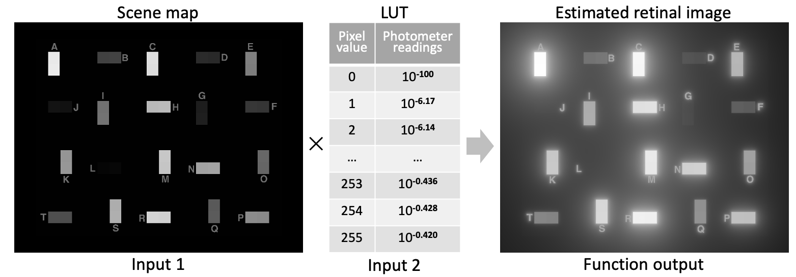

# retinal-contrast-glare
A set of (Python &amp; Matlab) functions for estimating the impact of **glare on the formed retinal image**, derived from **calibrated measurements of scene radiances**, or luminances. 

The reason for *not* directly using digital camera outputs, is that, **captured camera images do not represent accurate scene radiances**, because the scene information is transformed by the camera’s optical veiling glare, and nonlinear transformations in camera firmware and image software.



The function requires 2 separate inputs:
1. A **2D input map of the scene** (8-bit input image).
2. A look-up-table of **telephotometer readings** of the scene. 

This is done because telephotometers are the most reliable method of capturing accurate luminances without being affected by the effects of glare. In contrast, camera pixels would have been "contaminated" by glare. Based on these 2 inputs, the function computes the input scene luminances.

Then, a glare spread function is used in order to estimate the retinal image derived by the input scene luminaces. The glare spread function is taken from equation (8) of **Vos&van den Berg (1999) CIE standard** and is used to create a 2D convolution kernel. The kernel size is 2Rx2R, where R is the largest dimension of the input image map, in order to ensure that every pixel will "affect" every other one in the image. After that, the kernel is convolved with the input luminance image in order to estimate the cummulated contributions of different points of the scene, on the retinal image. The following is an example of a 600x600 glare spread function kernel.


Finally, different visualizations are generated and saved.


# Contents:
```tree
├── python                           [Directory: Python source code]
│   ├── requirements.txt             [Conda environment file for the required version of libraries]
│   ├── retinal_contrast.py          [Function for estimating retinal contrast from an input scene map and a telephotometer LUT file] 
│   └── test_retinal_contrast.py     [Example script for calling the function and testing one input scene]
├── matlab                           [Directory: Matlab source code]
│   ├── computeRetinalContrast.m     [Function for estimating retinal contrast from an input scene map and a telephotometer LUT file]
│   ├── visualizeLogImage.m          [Function for visualizing a log-encoded image]
│   └── testRetinalContrast.m        [Example script for calling the function and testing one input scene]
├── static                           [Directory: example output images]
└── data                             [Directory: sample test scenes]
    ├── scene1                       [Directory: example scene 1 map image and corresponding telephotometer LUT file]
    ├── scene2                       [Directory: example scene 2 map image and corresponding telephotometer LUT file]
    ├── scene3                       [Directory: example scene 3 map image and corresponding telephotometer LUT file]
    ├── scene4                       [Directory: example scene 4 map image and corresponding telephotometer LUT file]
    ├── scene5                       [Directory: example scene 5 map image and corresponding telephotometer LUT file]
    └── scene6                       [Directory: example scene 6 map image and corresponding telephotometer LUT file]
```


# Dependences
- skimage
- numpy
- imageio
- matplotlib
- scipy


# Python environment
The code is based on Python 3.8. You can generate a new package environment similar to the one that was used to develop this code, buy running the following command line inside the python directory, where the ```requirements.txt``` is located. 

```conda create --name <your_own_environment_name> --file requirements.txt```

Once you create your new environment from the requirements.txt, you can activate it with the following command. After that, you will be able to run the code.

```conda activate <your_own_environment_name>```


# Contributions and Acknowledgments
Vassilios Vonikakis wrote and implemented the Python code, during his time with the Advanced Digital Sciences Center - ADSC, as a continuation of an earlier Matlab-based project. He also collaborated with John McCann and Alessandro Rizzi in the analysis of the results. John McCann has brought together the glare and lightness research in collaboration with many others.  

The authors acknowledge the major contributions of Tom van den Berg, Joris Coppens, and Ivar Farup, in the design and implementation of this program; and W. A. Stiehl, Bob Savoy, Jon Frankle in the earlier study of glare. Without their many contributions this work would not be possible. The authors thank Mary McCann for her thoughtful discussions.


# Citation
If you use this code in your research please cite the following paper:   
1. [McCann, J., Vonikakis, V. (2018). Calculating Retinal Contrast from Scene Content: A Program. Frontiers in Psychology, 8, article 2079](https://www.frontiersin.org/articles/10.3389/fpsyg.2017.02079/full)
2. [John J. McCann, Vassilios Vonikakis, Alessandro Rizzi (2022). Edges and Gradients in Lightness Illusions: Role of Optical Veiling Glare. Frontiers in Psychology, 13, 10.3389/fpsyg.2022.958787](https://www.frontiersin.org/articles/10.3389/fpsyg.2022.958787/full)
